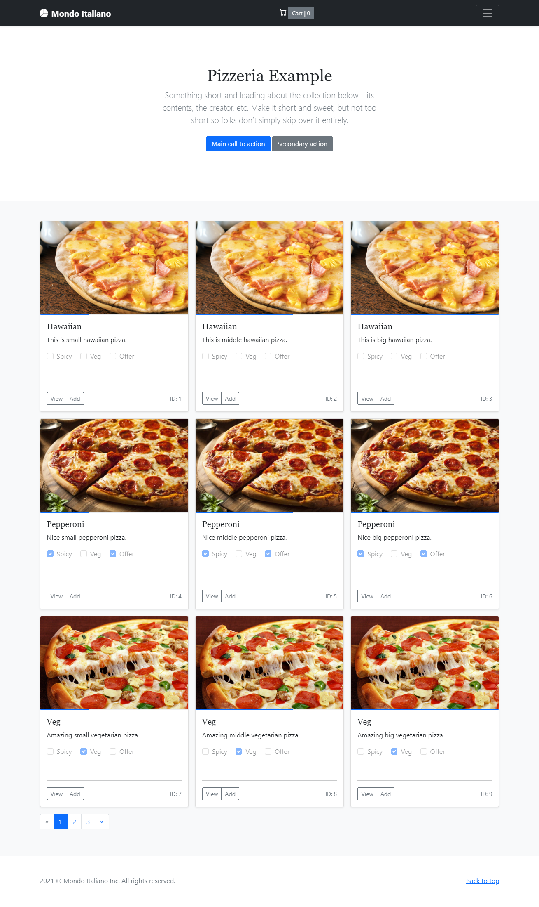
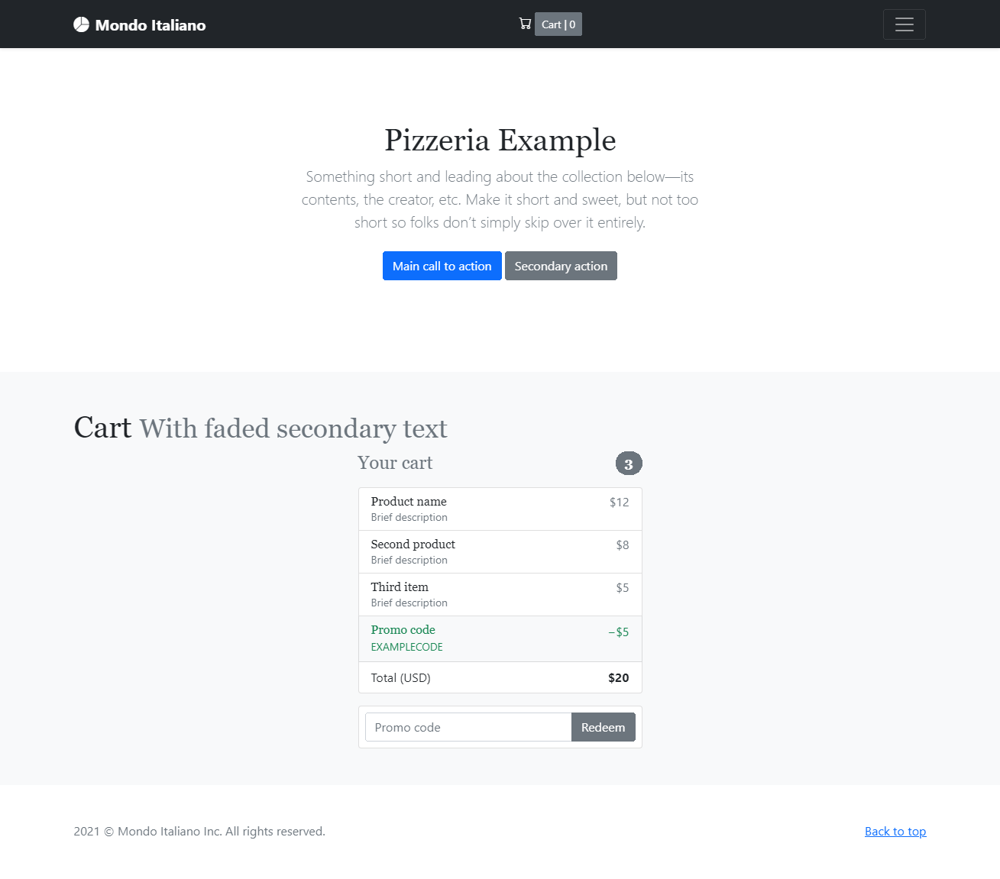
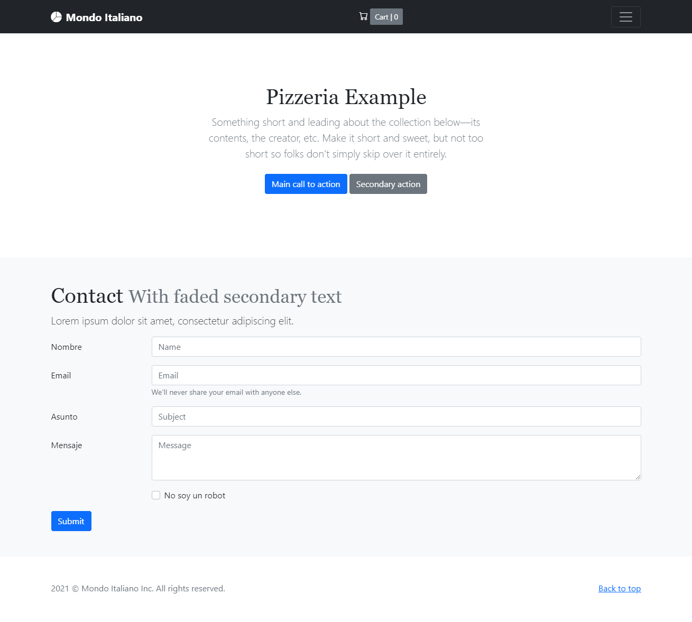

# Mondo Italiano

Es una tienda web para pizzería simple de usar, ligera, rápida y libre que está creado en El Reino de España.

**Mondo Italiano** se desarrolla con las siguientes fantasticas tecnologías:

* Ruby
* Sinatra
* SQLite
* Bootstrap
* jQuery

## De la caja:

* Lista de productos
* Página personal del producto
* Cesta de compras
* Formulario de contacto
* Verificación de formularios del lado de cliente y del servidor

## Ejecutar:

*bundle*

*bundle exec ruby app.rb*

## Pantallas:

Página de inicio:

Página de producto:

Cesta de compras:

Sobre:

Formulario de contacto:

