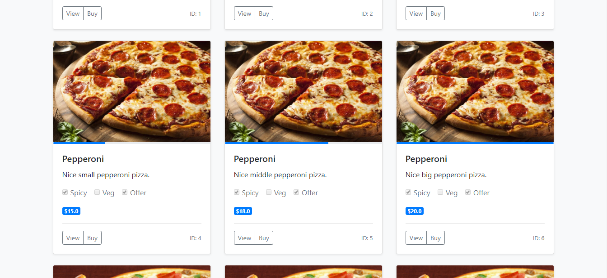
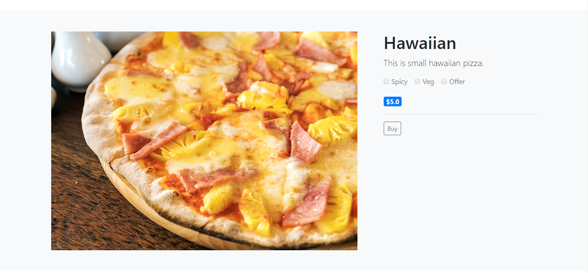

# Mondo Italiano App

es una tienda web para pizzeria simple de usar, ligera, rápida y libre que está creado en El Reino de España.

**Mondo Italiano App** se desarrolla con las siguientes fantasticas tecnologías:

* Ruby
* Sinatra
* SQLite
* Bootstrap
* jQuery

#### De la caja:

* Lista de productos
* Página personal del producto
* Cesta de compras
* Formulario de contacto
* Verificación de formularios

#### Licensia:

Eres libre y tienes derecho de hacer todo lo que quieres =)

#### Pantallas:

Lista de productos ->

Página del producto ->

Formulario de contacto ->
