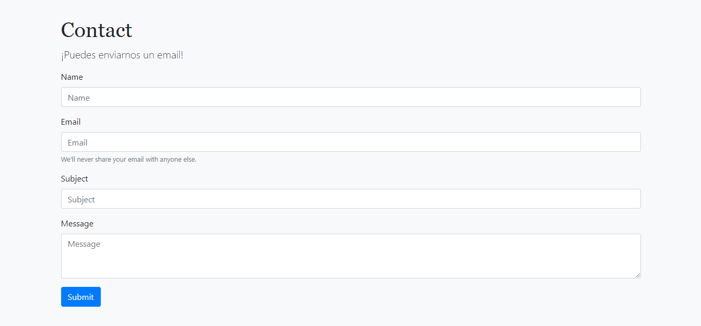

# Mondo Italiano App

**Mondo Italiano App** es una plantilla para pizzeria simple de usar, ligera, rápida y libre que está creado en El Reino de España.

**Mondo Italiano App** se desarrolla con las siguientes fantasticas tecnologías:

* Ruby
* Sinatra
* SQLite
* Bootstrap
* jQuery

#### De la caja

* Formulario de contacto
* Verificación de formularios

#### Licensia

Eres libre y tienes derecho de hacer todo lo que quieres.

#### Pantallas

Formulario de contacto

